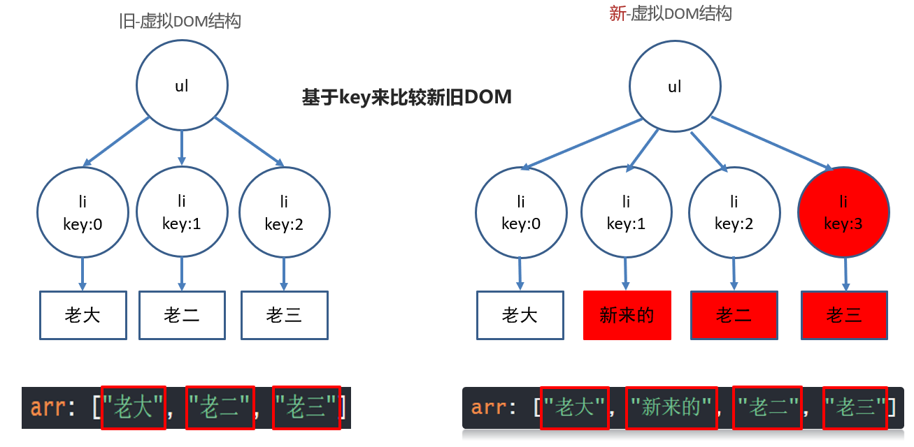
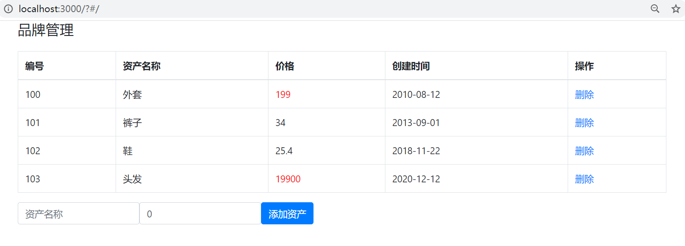

# Day03

## 知识点自测

- [ ] 会自己定义数据结构

```js
"红色","red", "蓝色","blue", 
// 上面的数据结构, 要用1个变量来装这4个值, 用什么数据结构呢?(数组还是对象) - 对象(可映射key->value)
    
"小明", "小蓝", "小赵"
// 上面的结构用数组比较合适
```

- [ ] 马上能反应过来循环遍历是什么, 索引(下角标)是什么

```js
let arr = [10, 32, 99];
// 索引就是数字, 标记每个值对应的序号, 从0开始
// 索引是0, 1, 2
// 数组需要用索引来换取值, 固定格式 arr[索引]
// 遍历就是挨个取出来
```

- [ ] 数组的filter方法使用

```js
let arr = [19, 29, 27, 20, 31, 32, 35];
let newArr = arr.filter((val) => {return val >= 30})
// 数组调用.filter()方法 - 传入一个函数体 (固定格式)
// 运行过程: filter会遍历数组里的每一项, 对每一项执行一次函数体(会把每个值传给形参)
// 作用: 每次遍历如果val值符合return的条件, 就会被filter收集起来
// 返回值: 当filter遍历结束以后, 返回收集到的符合条件的那些值形成的新数组
console.log(newArr);
```

- [ ] 重绘与回流(重排)的概念

```bash
回流(重排): 当浏览器必须重新处理和绘制部分或全部页面时，回流就会发生

重绘: 不影响布局, 只是标签页面发生变化, 重新绘制

注意: 回流(重排)必引发重绘, 重绘不一定引发回流(重排)
```

- [ ] localStorage浏览器本地存储语法使用

```bash
localStorage.setItem("key名", 值) - 把值存在浏览器本地叫key的对应位置上

localStorage.getItem("key名") - 把叫key的对应值, 从浏览器本地取出来

==值只能是字符串类型, 如果不是请用JSON.stringify转, 取出后用JSON.parse转==
```

- [ ] JSON的方法使用

```bash
JSON.stringify(JS数据) - 把JS数据序列化成JSON格式字符串

JSON.parse(JSON字符串)  - 把JSON格式化字符串, 再转回成JS数据
```

## 今日学习目标

1. 能够了解key作用, 虚拟DOM, diff算法
2. 能够掌握设置动态样式
3. 能够掌握过滤器, 计算属性, 侦听器
4. 能够完成品牌管理案例

## 1. vue基础

### 1.0_vue基础 v-for更新监测

> 目标: 当v-for遍历的目标结构改变, Vue触发v-for的更新

情况1: 数组翻转

情况2: 数组截取

情况3: 更新值

口诀:

数组变更方法, 就会导致v-for更新, 页面更新

数组非变更方法, 返回新数组, 就不会导致v-for更新, 可采用覆盖数组或this.$set()

```vue
<template>
  <div>
    <ul>
      <li v-for="(val, index) in arr" :key="index">
        {{ val }}
      </li>
    </ul>
    <button @click="revBtn">数组翻转</button>
    <button @click="sliceBtn">截取前3个</button>
    <button @click="updateBtn">更新第一个元素值</button>
  </div>
</template>

<script>
export default {
  data(){
    return {
      arr: [5, 3, 9, 2, 1]
    }
  },
  methods: {
    revBtn(){
      // 1. 数组翻转可以让v-for更新
      this.arr.reverse()
    },
    sliceBtn(){
      // 2. 数组slice方法不会造成v-for更新
      // slice不会改变原始数组
      // this.arr.slice(0, 3)

      // 解决v-for更新 - 覆盖原始数组
      let newArr = this.arr.slice(0, 3)
      this.arr = newArr
    },
    updateBtn(){
      // 3. 更新某个值的时候, v-for是监测不到的
      // this.arr[0] = 1000;

      // 解决-this.$set()
      // 参数1: 更新目标结构
      // 参数2: 更新位置
      // 参数3: 更新值
      this.$set(this.arr, 0, 1000)
    }
  }
}
</script>

<style>

</style>
```

这些方法会触发数组改变, v-for会监测到并更新页面

- `push()`
- `pop()`
- `shift()`
- `unshift()`
- `splice()`
- `sort()`
- `reverse()`

这些方法不会触发v-for更新

* `slice()`
* `filter()`
* `concat()` 

> 注意: vue不能监测到数组里赋值的动作而更新, 如果需要请使用Vue.set() 或者this.$set(), 或者覆盖整个数组

> 总结:  改变原数组的方法才能让v-for更新

### 1.1_vue基础_v-for就地更新

`v-for` 的默认行为会尝试原地修改元素而不是移动它们。

> 详解v-for就地更新流程(可以看ppt动画)


这种 虚拟DOM对比方式, 可以提高性能 - 但是还不够高

### 1.2_vue基础_虚拟dom

> 目标: 了解虚拟DOM的概念

.vue文件中的template里写的标签, 都是模板, 都要被vue处理成虚拟DOM对象, 才会渲染显示到真实DOM页面上

1. 内存中生成一样的虚拟DOM结构(==本质是个JS对象==)

   因为真实的DOM属性好几百个, 没办法快速的知道哪个属性改变了

   比如template里标签结构

   ```vue
   <template>
       <div id="box">
           <p class="my_p">123</p>
       </div>
   </template>
   ```

   对应的虚拟DOM结构

   ```js
   const dom = {
       type: 'div',
       attributes: [{id: 'box'}],
       children: {
           type: 'p',
           attributes: [{class: 'my_p'}],
           text: '123'
       }
   }
   ```

2. 以后vue数据更新

   * 生成新的虚拟DOM结构
   * 和旧的虚拟DOM结构对比
   * 利用diff算法, 找不不同, 只更新变化的部分(重绘/回流)到页面 - 也叫打补丁

==好处1: 提高了更新DOM的性能(不用把页面全删除重新渲染)==

==好处2: 虚拟DOM只包含必要的属性(没有真实DOM上百个属性)==

> 总结: 虚拟DOM保存在内存中, 只记录dom关键信息, 配合diff算法提高DOM更新的性能

在内存中比较差异, 然后给真实DOM打补丁更新上


### 1.3_vue基础_diff算法

vue用diff算法, 新虚拟dom, 和旧的虚拟dom比较

#### 情况1: 根元素变了, 删除重建 

旧虚拟DOM

```vue
<div id="box">
    <p class="my_p">123</p>
</div>
```

新虚拟DOM

```vue
<ul id="box">
    <li class="my_p">123</li>
</ul>
```

#### 情况2: 根元素没变, 属性改变, ==元素复用==, 更新属性

旧虚拟DOM

```vue
<div id="box">
    <p class="my_p">123</p>
</div>
```

新虚拟DOM

```vue
<div id="myBox" title="标题">
    <p class="my_p">123</p>
</div>
```

### 1.4_vue基础_diff算法-key

#### 情况3: 根元素没变, 子元素没变, 元素内容改变

##### 无key - 就地更新

v-for不会移动DOM, 而是尝试复用, 就地更新，如果需要v-for移动DOM, 你需要用特殊 attribute `key` 来提供一个排序提示

```vue
<ul id="myUL">
    <li v-for="str in arr">
        {{ str }} 
        <input type="text">
    </li>
</ul>
<button @click="addFn">下标为1的位置新增一个</button>
```

```js
export default {
    data(){
        return {
            arr: ["老大", "新来的", "老二", "老三"]
        }
    },
    methods: {
        addFn(){
            this.arr.splice(1, 0, '新来的')
        }
    }
};
```


旧 - 虚拟DOM结构  和  新 - 虚拟DOM结构 对比过程


==性能不高, 从第二个li往后都更新了==

##### 有key - 值为索引 

 - 还是就地更新

因为新旧虚拟DOM对比, key存在就复用此标签更新内容, 如果不存在就直接建立一个新的

```vue
<ul id="myUL">
    <li v-for="(str, index) in arr" :key="index">
        {{ str }} 
        <input type="text">
    </li>
</ul>
<button @click="addFn">下标为1的位置新增一个</button>
```

```js
export default {
    data(){
        return {
            arr: ["老大", "新来的", "老二", "老三"]
        }
    },
    methods: {
        addFn(){
            this.arr.splice(1, 0, '新来的')
        }
    }
};
```


key为索引-图解过程 (又就地往后更新了)





1. v-for先循环产生新的DOM结构, key是连续的, 和数据对应

2. 然后比较新旧DOM结构, 找到区别, 打补丁到页面上

   最后补一个li, 然后从第二个往后, 都要更新内容

> 口诀: key的值有id用id, 没id用索引

##### 有key - 值为id 

key的值只能是唯一不重复的, 字符串或数值

v-for不会移动DOM, 而是尝试复用, 就地更新，如果需要v-for移动DOM, 你需要用特殊 attribute `key` 来提供一个排序提示

新DOM里数据的key存在, 去旧的虚拟DOM结构里找到key标记的标签, 复用标签

新DOM里数据的key存在, 去旧的虚拟DOM结构里没有找到key标签的标签, 创建

旧DOM结构的key, 在新的DOM结构里没有了, 则==移除key所在的标签==

```vue
<template>
  <div>
    <ul>
      <li v-for="obj in arr" :key="obj.id">
        {{ obj.name }}
        <input type="text">
      </li>
    </ul>
    <button @click="btn">下标1位置插入新来的</button>
  </div>
</template>

<script>
export default {
  data() {
    return {
      arr: [
        {
          name: '老大',
          id: 50
        },
        {
          name: '老二',
          id: 31
        },
        {
          name: '老三',
          id: 10
        }
      ],
    };
  },
  methods: {
    btn(){
      this.arr.splice(1, 0, {
        id: 19, 
        name: '新来的'
      })
    }
  }
};
</script>

<style>
</style>
```

图解效果:


> 总结: 不用key也不影响功能(就地更新), 添加key可以提高更新的性能

### 1.5_阶段小结

v-for什么时候会更新页面呢?

* 数组采用更新方法, 才导致v-for更新页面

vue是如何提高更新性能的?

* 采用虚拟DOM+diff算法提高更新性能

虚拟DOM是什么?

* 本质是保存dom关键信息的JS对象

diff算法如何比较新旧虚拟DOM?

* 根元素改变 – 删除当前DOM树重新建
* 根元素未变, 属性改变 – 更新属性
* 根元素未变, 子元素/内容改变
* 无key – 就地更新 / 有key – 按key比较

### 1.6_vue基础 动态class

> 目标: 用v-bind给标签class设置动态的值

* 语法:
  * :class="{类名: 布尔值}"

```vue
<template>
  <div>
    <!-- 语法:
      :class="{类名: 布尔值}"
      使用场景: vue变量控制标签是否应该有类名
     -->
    <p :class="{red_str: bool}">动态class</p>
  </div>
</template>

<script>
export default {
  data(){
    return {
      bool: true
    }
  }
}
</script>

<style scoped>
  .red_str{
    color: red;
  }
</style>
```

> 总结: 就是把类名保存在vue变量中赋予给标签

### 1.7_vue基础-动态style

> 目标: 给标签动态设置style的值

* 语法
  * :style="{css属性: 值}"

```vue
<template>
  <div>
    <!-- 动态style语法
      :style="{css属性名: 值}"
     -->
    <p :style="{backgroundColor: colorStr}">动态style</p>
  </div>
</template>

<script>
export default {
  data(){
    return {
      colorStr: 'red'
    }
  }
}
</script>

<style>

</style>
```

> 总结: 动态style的key都是css属性名

### 1.8_案例-品牌管理(铺)

> 目标: 数据铺设

* 需求1: 把默认数据显示到表格上
* 需求2: 注意资产超过100的, 都用红色字体标记出来

细节:

​	① 先铺设静态页面 --- 去.md文档里, 复制数据和标签模板

​	② 此案例使用bootstrap, 需要下载, 并导入到工程main.js中

​	③ 用v-for配合默认数据, 把数据默认铺设到表格上显示

​	④ 直接在标签上, 大于100价格, 动态设置red类名

图示:


1. 因为案例使用了bootstrap, 工程化开发, 模块化用npm/yarn下载引入使用

```bash
yarn add bootstrap
```

2. 在main.js - 引入bootstrap

```js
import "bootstrap/dist/css/bootstrap.css" // 默认找文件夹下的index文件(但是这个不是所以需要写路径)
```

3. 模板代码(在这个基础上写)

```vue
<template>
  <div id="app">
    <div class="container">
      <!-- 顶部框模块 -->
      <div class="form-group">
        <div class="input-group">
          <h4>品牌管理</h4>
        </div>
      </div>

      <!-- 数据表格 -->
      <table class="table table-bordered table-hover mt-2">
        <thead>
          <tr>
            <th>编号</th>
            <th>资产名称</th>
            <th>价格</th>
            <th>创建时间</th>
            <th>操作</th>
          </tr>
        </thead>
        <tbody>
          <tr >
            <td></td>
            <td></td>

            <!-- 如果价格超过100，就有red这个类 -->
            <td class="red"></td>
            <td></td>
            <td><a href="#" >删除</a></td>
          </tr>
        </tbody>
          <!-- 
        <tfoot >
          <tr>
            <td colspan="5" style="text-align: center">暂无数据</td>
          </tr>
        </tfoot>
            -->
      </table>

      <!-- 添加资产 -->
      <form class="form-inline">
        <div class="form-group">
          <div class="input-group">
            <input
              type="text"
              class="form-control"
              placeholder="资产名称"
            />
          </div>
        </div>
        &nbsp;&nbsp;&nbsp;&nbsp;
        <div class="form-group">
          <div class="input-group">
            <input
              type="text"
              class="form-control"
              placeholder="价格"
            />
          </div>
        </div>
        &nbsp;&nbsp;&nbsp;&nbsp;
        <!-- 阻止表单提交 -->
        <button class="btn btn-primary">添加资产</button>
      </form>
    </div>
  </div>
</template>

<script>

export default {
  data() {
    return {
      name: "", // 名称
      price: 0, // 价格
      list: [
        { id: 100, name: "外套", price: 199, time: new Date('2010-08-12')},
        { id: 101, name: "裤子", price: 34, time: new Date('2013-09-01') },
        { id: 102, name: "鞋", price: 25.4, time: new Date('2018-11-22') },
        { id: 103, name: "头发", price: 19900, time: new Date('2020-12-12') }
      ],
    };
  },

};
</script>

<style >
.red{
  color: red;
}
</style>
```

==正确代码, 不可复制==

```vue
<tbody>
    <tr v-for="obj in list" :key="obj.id">
        <td>{{ obj.id }}</td>
        <td>{{ obj.name }}</td>

        <!-- 如果价格超过100，就有red这个类 -->
        <td :class="{red: obj.price > 100}">{{ obj.price }}</td>
        <td>{{ obj.time }}</td>
        <td><a href="#" >删除</a></td>
    </tr>
</tbody>

<script>
// 1. 明确需求
// 2. 标签+样式+默认数据
// 3. 下载bootstrap, main.js引入bootstrap.css
// 4. 把list数组 - 铺设表格
// 5. 修改价格颜色
</script>
```

### 1.9_案例-品牌管理(增)

> 目标: 数据新增

* 需求1: 实现表单数据新增进表格功能
* 需求2: 判断用户输入是否为空给提示

* 分析

  ① 添加资产按钮 – 绑定点击事件

  ② 给表单v-model绑定vue变量收集用户输入内容

  ③ 添加数组到数组中

  ④ 判断用户内容是否符合规定

图示:


在上个案例代码基础上接着写

==正确代码,不可复制==

```vue
<!-- 添加资产 -->
      <form class="form-inline">
        <div class="form-group">
          <div class="input-group">
            <input
              type="text"
              class="form-control"
              placeholder="资产名称"
              v-model="name"
            />
          </div>
        </div>
        &nbsp;&nbsp;&nbsp;&nbsp;
        <div class="form-group">
          <div class="input-group">
            <input
              type="text"
              class="form-control"
              placeholder="价格"
              v-model.number="price"
            />
          </div>
        </div>
        &nbsp;&nbsp;&nbsp;&nbsp;
        <!-- 4. 阻止表单提交(刷新网页数据又回去了) -->
        <button class="btn btn-primary" @click.prevent="addFn">添加资产</button>
      </form>

<script>
// 目标: 新增
// 1. 按钮 - 事件
// 2. 给表单v-model绑定vue变量
export default {
  // ...省略其他
  methods: {
    addFn(){
      // 5. 判断是否为空
      if (this.name.trim().length === 0 || this.price === 0) {
        alert("不能为空")
        return
      }
      // 3. 把值以对象形式-插入list
      this.list.push({
        // 当前数组最后一个对象的id+1作为新对象id值
        id: this.list[this.list.length - 1].id + 1,
        name: this.name,
        price: this.price,
        time: new Date()
      })
    }
  }
};
</script>
```

### 1.10_案例-品牌管理(删)

> 目标: 数据删除

* 需求1: 点击删除的a标签, 删除数据
* 需求2: 删除没数据了要提示暂无数据的tfoot

* 分析

  ① a标签绑定点击事件

  ② 给事件方法传id

  ③ 通过id, 找到对应数据删除

  ④ 删除光了要让tfoot显示

  ⑤ 删除光了再新增, 有bug(id值问题)需要修复

图示:


在上个案例代码基础上接着写

正确的代码(==不可复制==)

```vue

<td><a href="#" @click="delFn(obj.id)">删除</a></td>
          
<script>
// 目标: 删除功能
// 1. 删除a标签-点击事件
// 2. 对应方法名
// 3. 数据id到事件方法中
// 4. 通过id, 找到这条数据在数组中的下标
// 5. splice方法删除原数组里的对应元素
// 6. 设置tfoot, 无数据给出提示
// 7. 无数据再新增, id要判断一下
export default {
  // ...其他代码
  methods: {
    // ...其他代码
    delFn(id){
      // 通过id找到这条数据在数组中下标
      let index = this.list.findIndex(obj => obj.id === id)
      this.list.splice(index, 1)
    }
  }
};
</script>
```

## 2. vue过滤器

### 2.0_vue过滤器-定义使用

> 目的: 转换格式, 过滤器就是一个**函数**, 传入值返回处理后的值

过滤器只能用在, ==插值表达式和v-bind表达式==

Vue中的过滤器场景

* 字母转大写, 输入"hello", 输出"HELLO"
* 字符串翻转, "输入hello, world", 输出"dlrow ,olleh"

语法: 

* Vue.filter("过滤器名", (值) => {return "返回处理后的值"})

* filters: {过滤器名字: (值) => {return "返回处理后的值"}

例子:

* 全局定义字母都大写的过滤器
* 局部定义字符串翻转的过滤器

```vue
<template>
  <div>
    <p>原来的样子: {{ msg }}</p>
    <!-- 2. 过滤器使用
      语法: {{ 值 | 过滤器名字 }}
     -->
    <p>使用翻转过滤器: {{ msg | reverse }}</p>
    <p :title="msg | toUp">鼠标长停</p>
  </div>
</template>

<script>
export default {
  data(){
    return {
      msg: 'Hello, Vue'
    }
  },
  // 方式2: 局部 - 过滤器
  // 只能在当前vue文件内使用
  /*
     语法: 
     filters: {
       过滤器名字 (val) {
         return 处理后的值
       }
     }
  */
  filters: {
    toUp (val) {
      return val.toUpperCase()
    }
  }
}
</script>

<style>

</style>
```

> 总结: 把值转成另一种形式, 使用过滤器, Vue3用函数替代了过滤器.
>
> 全局注册最好在main.js中注册, 一处注册到处使用

### 2.1_vue过滤器-传参和多过滤器

> 目标: 可同时使用多个过滤器, 或者给过滤器传参

* 语法:
  * 过滤器传参:   vue变量 | 过滤器(实参) 
  * 多个过滤器:   vue变量 | 过滤器1 | 过滤器2

```vue
<template>
  <div>
    <p>原来的样子: {{ msg }}</p>
    <!-- 1.
      给过滤器传值
      语法: vue变量 | 过滤器名(值)
     -->
    <p>使用翻转过滤器: {{ msg | reverse('|') }}</p>
    <!-- 2.
      多个过滤利使用
      语法: vue变量 | 过滤器1 | 过滤器2
     -->
    <p :title="msg | toUp | reverse('|')">鼠标长停</p>
  </div>
</template>

<script>
export default {
  data(){
    return {
      msg: 'Hello, Vue'
    }
  },
  filters: {
    toUp (val) {
      return val.toUpperCase()
    }
  }
}
</script>

<style>

</style>
```

> 总结: 过滤器可以传参, 还可以对某个过滤器结果, 后面在使用一个过滤器

### 2.2_案例-品牌管理(时间格式化)

> 目标: 复制上个案例, 在此基础上, 把表格里的时间用过滤器+moment模块, 格式化成YYYY-MM-DD 格式

图示: 



1. 下载moment处理日期的第三方工具模块

   moment官网文档: http://momentjs.cn/docs/#/displaying/

   ```bash
   yarn add moment
   ```

2. 定义过滤器, 把时间用moment模块格式化, 返回我们想要的格式

   ```js
   // 目标: 处理时间
   // 1. 下载moment模块
   import moment from 'moment'
   
   
   // 2. 定义过滤器, 编写内部代码
   filters: { 
       formatDate (val){
           return moment(val).format('YYYY-MM-DD')
       }
   }
   
   <!-- 3. 使用过滤器 -->
   <td>{{ obj.time | formatDate }}</td>
   ```

## 3. vue计算属性

### 3.0_vue计算属性-computed

> 目标: 一个数据, 依赖另外一些数据计算而来的结果

语法:

* ```js
  computed: {
      "计算属性名" () {
          return "值"
      }
  }
  ```

需求: 

* 需求: 求2个数的和显示到页面上

```vue
<template>
  <div>
    <p>{{ num }}</p>
  </div>
</template>

<script>
export default {
  data(){
    return {
      a: 10,
      b: 20
    }
  },
  // 计算属性:
  // 场景: 一个变量的值, 需要用另外变量计算而得来
  /*
    语法:
    computed: {
      计算属性名 () {
        return 值
      }
    }
  */
 // 注意: 计算属性和data属性都是变量-不能重名
 // 注意2: 函数内变量变化, 会自动重新计算结果返回
  computed: {
    num(){
      return this.a + this.b
    }
  }
}
</script>

<style>

</style>
```

> 注意: 计算属性也是vue数据变量, 所以不要和data里重名, 用法和data相同

> 总结: 一个数据, 依赖另外一些数据计算而来的结果

### 3.1_vue计算属性-缓存

> 目标: 计算属性是基于它们的依赖项的值结果进行缓存的，只要依赖的变量不变, 都直接从缓存取结果


```vue
<template>
  <div>
    <p>{{ reverseMessage }}</p>
    <p>{{ reverseMessage }}</p>
    <p>{{ reverseMessage }}</p>
    <p>{{ getMessage() }}</p>
    <p>{{ getMessage() }}</p>
    <p>{{ getMessage() }}</p>
  </div>
</template>

<script>
export default {
  data(){
    return {
      msg: "Hello, Vue"
    }
  },
  // 计算属性优势:
  // 带缓存
  // 计算属性对应函数执行后, 会把return值缓存起来
  // 依赖项不变, 多次调用都是从缓存取值
  // 依赖项值-变化, 函数会"自动"重新执行-并缓存新的值
  computed: {
    reverseMessage(){
      console.log("计算属性执行了");
      return this.msg.split("").reverse().join("")
    }
  },
  methods: {
    getMessage(){
      console.log("函数执行了");
      return this.msg.split("").reverse().join("")
    }
  }
}
</script>

<style>

</style>
```

> 总结: 计算属性根据依赖变量结果缓存, 依赖变化重新计算结果存入缓存, 比普通方法性能更高

### 3.2_案例-品牌管理(总价和均价)

> 目标: 基于之前的案例, 完成总价和均价的计算效果


此处只修改了变化的代码

```vue
<tr style="background-color: #EEE">
     <td>统计:</td>
     <td colspan="2">总价钱为: {{ allPrice }}</td>
     <td colspan="2">平均价: {{ svgPrice }}</td>
</tr>

<script>
// 目标: 总价和均价显示
// 1. 末尾补tr - 显示总价和均价
export default {
  // ...源代码省略
  // 2. 计算属性
  computed: {
      allPrice(){
          // 3. 求总价
          return this.list.reduce((sum, obj) => sum += obj.price, 0)
      },
      avgPrice(){
          // 4. 求均价 - 保留2位小数
          return (this.allPrice / this.list.length).toFixed(2)
      }
  }
}
</script>
```

> 总结: 总价来源于所有数据计算而来的结果, 故采用计算属性

### 3.3_vue计算属性-完整写法

> 目标: 计算属性也是变量, 如果想要直接赋值, 需要使用完整写法

语法:

```js
computed: {
    "属性名": {
        set(值){
            
        },
        get() {
            return "值"
        }
    }
}
```

需求: 

* 计算属性给v-model使用

页面准备输入框

```vue
<template>
  <div>
      <div>
          <span>姓名:</span>
          <input type="text" v-model="full">
      </div>
  </div>
</template>

<script>
// 问题: 给计算属性赋值 - 需要setter
// 解决:
/*
    完整语法:
    computed: {
        "计算属性名" (){},
        "计算属性名": {
            set(值){

            },
            get(){
                return 值
            }
        }
    }
*/
export default {
    computed: {
        full: {
            // 给full赋值触发set方法
            set(val){
                console.log(val)
            },
            // 使用full的值触发get方法
            get(){
                return "无名氏"
            }
        }
    }
}
</script>

<style>

</style>
```

> 总结: 想要给计算属性赋值, 需要使用set方法

### 3.4_案例-小选影响全选

> 目标: 小选框都选中(手选), 全选自动选中

* 需求: 小选框都选中(手选), 全选自动选中

分析:

① 先静态后动态, 从.md拿到静态标签和数据

② 循环生成复选框和文字, 对象的c属性和小选框的选中状态, 用v-model双向绑定

③ 定义isAll计算属性, 值通过小选框们统计c属性状态得来

图示:


模板标签和数据(==直接复制在这基础上写vue代码==)

```vue
<template>
  <div>
    <span>全选:</span>
    <input type="checkbox"/>
    <button>反选</button>
    <ul>
      <li>
        <input type="checkbox"/>
        <span>任务名</span>
      </li>
    </ul>
  </div>
</template>

<script>
export default {
  data() {
    return {
      arr: [
        {
          name: "猪八戒",
          c: false,
        },
        {
          name: "孙悟空",
          c: false,
        },
        {
          name: "唐僧",
          c: false,
        },
        {
          name: "白龙马",
          c: false,
        },
      ],
    };
  }
};
</script>
```

==正确代码,不可复制==

```vue
<template>
  <div>
    <span>全选:</span>
    <!-- 4. v-model 关联全选 - 选中状态 -->
    <input type="checkbox" v-model="isAll"/>
    <button>反选</button>
    <ul>
      <li v-for="(obj, index) in arr" :key="index">
        <!-- 3. 对象.c - 关联 选中状态 -->
        <input type="checkbox" v-model="obj.c"/>
        <span>{{ obj.name }}</span>
      </li>
    </ul>
  </div>
</template>

<script>
// 目标: 小选框 -> 全选
// 1. 标签+样式+js准备好
// 2. 把数据循环展示到页面上
export default {
  data() {
    return {
      arr: [
        {
          name: "猪八戒",
          c: false,
        },
        {
          name: "孙悟空",
          c: false,
        },
        {
          name: "唐僧",
          c: false,
        },
        {
          name: "白龙马",
          c: false,
        },
      ],
    };
  },
  // 5. 计算属性-isAll
  computed: {
    isAll () {
         // 6. 统计小选框状态 ->  全选状态
        // every口诀: 查找数组里"不符合"条件, 直接原地返回false
        return this.arr.every(obj => obj.c === true)
    }
  }
};
</script>
```

### 3.5_案例-全选影响小选

> 目标: 全选影响小选

* 需求1: 获取到全选状态 – 改装isAll计算属性
* 需求2: 全选状态同步给所有小选框

分析:

①: isAll改成完整写法, set里获取到全选框, 勾选的状态值

②: 遍历数据数组, 赋给所有小选框v-model关联的属性

图示:


==正确代码,不可以复制==

```vue
<script>
export default {
  // ...其他代码
  // 5. 计算属性-isAll
  computed: {
    isAll: {
      set(val){
        // 7. 全选框 - 选中状态(true/false)
        this.arr.forEach(obj => obj.c = val)
      },
      get(){
        // 6. 统计小选框状态 ->  全选状态
        // every口诀: 查找数组里"不符合"条件, 直接原地返回false
        return this.arr.every(obj => obj.c === true)
      }
    }
  }
};
</script>
```

### 3.6_案例-反选

> 目标: 反选功能

* 需求: 点击反选, 让所有小选框, 各自取相反勾选状态

分析:

①: 小选框的勾选状态, 在对象的c属性

②: 遍历所有对象, 把对象的c属性取相反值赋予回去即可

图示:


==正确代码,不可以复制==

```vue

<button @click="btn">反选</button>

<script>
export default {
  // ...其他代码省略
  methods: {
    btn(){
      // 8. 让数组里对象的c属性取反再赋予回去
      this.arr.forEach(obj => obj.c = !obj.c)
    }
  }
};
</script>
```

## 4. vue侦听器

### 4.0_vue侦听器-watch

> 目标: 可以侦听data/computed属性值改变

语法:

* ```js
  watch: {
      "被侦听的属性名" (newVal, oldVal){
          
      }
  }
  ```

完整例子代码:

```vue
<template>
  <div>
    <input type="text" v-model="name">
  </div>
</template>

<script>
export default {
  data(){
    return {
      name: ""
    }
  },
  // 目标: 侦听到name值的改变
  /*
  语法:
    watch: {
      变量名 (newVal, oldVal){
        // 变量名对应值改变这里自动触发
      }
    }
  */
  watch: {
    // newVal: 当前最新值
    // oldVal: 上一刻值
    name(newVal, oldVal){
      console.log(newVal, oldVal);
    }
  }
}
</script>

<style>

</style>
```

> 总结: 想要侦听一个属性变化, 可使用侦听属性watch

### 4.1_vue侦听器-深度侦听和立即执行  

> 目标: 侦听复杂类型, 或者立即执行侦听函数

* 语法:

  ```js
  watch: {
      "要侦听的属性名": {
          immediate: true, // 立即执行
          deep: true, // 深度侦听复杂类型内变化
          handler (newVal, oldVal) {
              
          }
      }
  }
  ```

完整例子代码:

```vue
<template>
  <div>
    <input type="text" v-model="user.name">
    <input type="text" v-model="user.age">
  </div>
</template>

<script>
export default {
  data(){
    return {
      user: {
        name: "",
        age: 0
      }
    }
  },
  // 目标: 侦听对象
  /*
  语法:
    watch: {
      变量名 (newVal, oldVal){
        // 变量名对应值改变这里自动触发
      },
      变量名: {
        handler(newVal, oldVal){

        },
        deep: true, // 深度侦听(对象里面层的值改变)
        immediate: true // 立即侦听(网页打开handler执行一次)
      }
    }
  */
  watch: {
    user: {
      handler(newVal, oldVal){
        // user里的对象
        console.log(newVal, oldVal);
      },
      deep: true,
      immediate: true
    }
  }
}
</script>

<style>

</style>
```

> 总结: immediate立即侦听, deep深度侦听, handler固定方法触发

### 4.2_案例-品牌管理(数据缓存)

> 目标: 侦听list变化, 同步到浏览器本地

* 需求: 把品牌管理的数据实时同步到本地缓存

分析:

​	① 在watch侦听list变化的时候, 把最新的数组list转成JSON字符串存入到localStorage本地

​	② data里默认把list变量从本地取值, 如果取不到给个默认的空数组

效果:

​	新增/删除 – 刷新页面 – 数据还在

在之前的案例代码基础上接着写

==正确代码,不可复制==

```vue
<script>
import moment from "moment";
export default {
  data() {
    return {
      name: "", // 名称
      price: 0, // 价格
      // 3. 本地取出缓存list
      list: JSON.parse(localStorage.getItem('pList')) || [],
    };
  },
  // ...其他代码省略
  watch: {
    list: {
      handler(){
        // 2. 存入本地
        localStorage.setItem('pList', JSON.stringify(this.list))
      },
      deep: true
    }
  }
};
</script>
```

## 今日总结

- [ ] v-for能监测到哪些数组方法变化, 更新页面
- [ ] key的作用是什么
- [ ] 虚拟dom好处, diff算法效果
- [ ] 动态设置class或style
- [ ] vue过滤器作用和分类
- [ ] vue计算属性作用
- [ ] vue侦听器的作用


## 面试题

### 1. Vue 中怎么自定义过滤器

​    Vue.js允许自定义过滤器，可被用于一些常见的文本格式化。过滤器可以用在两个地方：双花括号插值和v-bind表达式

​	全局的用Vue.filter()

​	局部的用filters属性

### 2. Vue中:key作用, 为什么不能用索引

​	:key是给v-for循环生成标签颁发唯一标识的, 用于性能的优化

​	因为v-for数据项的顺序改变，Vue 也不会移动 DOM 元素来匹配数据项的顺序，而是就地更新每个元素

​	:key如果是索引, 因为索引是连续的, 如果删除其中某一个, 会导致最后一个被删除

​	当我们再删除的时候, :key再根据数据来把新旧的dom对比时, 删除:key不存在的对应的标签(添加也是一样的插入到指定位置, 别的都不会动)

### 3. 数组更新有的时候v-for不渲染

​	因为vue内部只能监测到数组顺序/位置的改变/数量的改变, 但是值被重新赋予监测不到变更, 可以用 Vue.set() / vm.$set()

## 附加练习_1.买点书练习

> 目标: 把数据铺设到页面上, 当用户点击买书按钮, 书籍数量增加1, 并且要计算累计的和

演示:


标签结构和数据(==复制接着写==): 

```vue
<template>
  <div>
    <p>请选择你要购买的书籍</p>
    <ul>
    </ul>
    <table border="1" width="500" cellspacing="0">
      <tr>
        <th>序号</th>
        <th>书名</th>
        <th>单价</th>
        <th>数量</th>
        <th>合计</th>
      </tr>
    </table>
    <p>总价格为: </p>
  </div>
</template>

<script>
export default {
  data() {
    return {
      arr: [
        {
          name: "水浒传",
          price: 107,
          count: 0,
        },
        {
          name: "西游记",
          price: 192,
          count: 0,
        },
        {
          name: "三国演义",
          price: 219,
          count: 0,
        },
        {
          name: "红楼梦",
          price: 178,
          count: 0,
        },
      ],
    };
  }
};
</script>
```

正确答案(==不可复制==)

```vue
<template>
  <div>
    <p>请选择你要购买的书籍</p>
    <ul>
      <li v-for="(item, ind) in arr" :key="ind">
        <span>{{ item["name"] }}</span>
        <button @click="buy(ind)">买书</button>
      </li>
    </ul>
    <table border="1" width="500" cellspacing="0">
      <tr>
        <th>序号</th>
        <th>书名</th>
        <th>单价</th>
        <th>数量</th>
        <th>合计</th>
      </tr>
      <tr v-for="(item, index) in arr" :key="index">
        <td>{{ index + 1 }}</td>
        <td>{{ item["name"] }}</td>
        <td>{{ item["price"] }}</td>
        <td>{{ item["count"] }}</td>
        <td>{{ item["price"] * item["count"] }}</td>
      </tr>
    </table>
    <p>总价格为: {{ allPrice }}</p>
  </div>
</template>

<script>
export default {
  data() {
    return {
      arr: [
        {
          name: "水浒传",
          price: 107,
          count: 0,
        },
        {
          name: "西游记",
          price: 192,
          count: 0,
        },
        {
          name: "三国演义",
          price: 219,
          count: 0,
        },
        {
          name: "红楼梦",
          price: 178,
          count: 0,
        },
      ],
    };
  },
  methods: {
    buy(index) {
      this.arr[index]["count"]++;
    },
  },
  computed: {
    allPrice() {
      // 数组里放的是对象, 而对象是复杂类型, 引用关系, 值改变会触发计算属性重新执行
      return this.arr.reduce((sum, obj) => {
        return (sum += obj["price"] * obj["count"]);
      }, 0);
    },
  },
};
</script>

<style>
</style>
```

## 附加练习_2.选你爱我求和

> 目标: 把用户选中的数字, 累计求和显示

提示: 

* v-model绑定的变量是数组, 可以收集checkbox的value属性呦

演示:


数据(复制):

```js
[9, 15, 19, 25, 29, 31, 48, 57, 62, 79, 87]
```

正确答案:(==先不要看==)

```html
<template>
  <div>
    <!-- 无id时, 可以使用index(反正也是就地更新) -->
    <div
      v-for="(item, index) in arr"
      style="display: inline-block"
      :key="index"
    >
      <input type="checkbox" v-model="checkNumArr" :value="item" />
      <span>{{ item }}</span>
    </div>
    <p>你选中的元素, 累加的值和为: {{ theSum }}</p>
  </div>
</template>

<script>
export default {
  data() {
    return {
      arr: [9, 15, 19, 25, 29, 31, 48, 57, 62, 79, 87],
      checkNumArr: [], //  保存用户选中的数字
    };
  },
  computed: {
    theSum() {
      return this.checkNumArr.reduce((sum, val) => {
        return (sum += val);
      }, 0);
    },
  },
};
</script>

<style>
</style>
```

> 总结, 当计算属性函数里引用的vue变量发生改变, 函数就执行并重新返回结果并缓存起来

## 今日作业

先把课上案例搂一遍

### 移动端-导航切换效果

目标: 切换到移动端画面, 点击导航, 高亮

> 提示: 索引 / 高亮的class样式

图例:


不带vue的标签结构(==可复制接着写==)

```html
<template>
  <div class="wrap">
    <div class="nav_left" id="navLeft">
      <div class="nav_content">
        <span class="active">导航名字</span>
      </div>
    </div>
    <div class="down">
      <i class="iconfont icon-xiajiantoubeifen gray"></i>
    </div>
  </div>
</template>

<script>
export default {
  data() {
    return {
      arr: [
        {
          first_id: "0",
          first_name: "热门"
        },
        {
          first_id: "621",
          first_name: "\u5496\u5561",
        },
        {
          first_id: "627",
          first_name: "\u996e\u98df",
        },
        {
          first_id: "279",
          first_name: "\u7537\u88c5",
        },
        {
          first_id: "294",
          first_name: "\u5973\u88c5",
        },
        {
          first_id: "122",
          first_name: "\u773c\u955c",
        },
        {
          first_id: "339",
          first_name: "\u5185\u8863\u914d\u9970",
        },
        {
          first_id: "391",
          first_name: "\u6bcd\u5a74",
        },
        {
          first_id: "35",
          first_name: "\u978b\u9774",
        },
        {
          first_id: "39",
          first_name: "\u8fd0\u52a8",
        },
        {
          first_id: "153",
          first_name: "\u7bb1\u5305",
        },
        {
          first_id: "119",
          first_name: "\u7f8e\u5986\u4e2a\u62a4",
        },
        {
          first_id: "355",
          first_name: "\u5bb6\u7eba",
        },
        {
          first_id: "51",
          first_name: "\u9910\u53a8",
        },
        {
          first_id: "334",
          first_name: "\u7535\u5668",
        },
        {
          first_id: "369",
          first_name: "\u5bb6\u88c5",
        },
        {
          first_id: "10",
          first_name: "\u5bb6\u5177",
        },
        {
          first_id: "223",
          first_name: "\u6570\u7801",
        },
        {
          first_id: "429",
          first_name: "\u6c7d\u914d",
        },
        {
          first_id: "546",
          first_name: "\u5065\u5eb7\u4fdd\u5065",
        },
        {
          first_id: "433",
          first_name: "\u5b9a\u5236",
        },
      ],
    };
  },

};
</script>

<style>
.wrap {
  width: 100%;
  display: flex;
  margin: 0.2rem 0 0 0;
  position: relative;
}

/*左侧的导航样式*/
.nav_left {
  width: 21.1875rem;
  overflow: scroll;
}

.nav_left::-webkit-scrollbar {
  display: none;
}

.nav_content {
  white-space: nowrap;
  padding: 0 0.7rem;
}

.nav_content span {
  display: inline-block;
  padding: 0.4rem 0.6rem;
  font-size: 0.875rem;
}

.nav_content .active {
  border-bottom: 2px solid #7f4395;
  color: #7f4395;
}

.nav_left,
.down {
  float: left;
}

/*右侧导航部分*/
.down {
  flex: 1;
  display: flex;
  align-items: center;
  justify-content: center;
}

.gray {
  color: gray;
  display: inline-block;
  vertical-align: middle;
}
</style>
```

### 学生信息管理

==如果1个按钮不会写, 用2个按钮写==

目标: 

* 需求1: 铺设页面, 准备初始的数据(自己手写数据结构) - 前面是数组索引+1 *作为序号
* 需求2: 当输入框没有值, 要给用户一个提示, 必须都有值才能增加新数据 (数据驱动页面哦)
* 需求3: 添加功能 - 想好数据结构统一对象的key
* 需求4: 点击编辑功能, 把值赋予到输入框上(不要操作dom, 数据驱动页面)
* 需求5: 用户修改后, 点击相同按钮 - 想想怎么判断怎么是添加还是修改的功能 (提示: 准备一个全局变量, 点过编辑按钮可以让它为true) - 实现编辑后更新页面效果
* 需求6: 点击删除, 删除这行数据


不带vue代码的标签结构(==可复制接着写==)

```vue
<template>
  <div id="app">
    <div>
      <span>姓名:</span>
      <input type="text" />
    </div>
    <div>
      <span>年龄:</span>
      <input type="number" />
    </div>
    <div>
      <span>性别:</span>
      <select >
        <option value="男">男</option>
        <option value="女">女</option>
      </select>
    </div>
    <div>
      <button >添加/修改</button>
    </div>
    <div>
      <table
        border="1"
        cellpadding="10"
        cellspacing="0"
      >
        <tr>
          <th>序号</th>
          <th>姓名</th>
          <th>年龄</th>
          <th>性别</th>
          <th>操作</th>
        </tr>
        <tr >
          <td></td>
          <td></td>
          <td></td>
          <td></td>
          <td>
            <button >删除</button>
            <button >编辑</button>
          </td>
        </tr>
      </table>
    </div>
  </div>
</template>
<script>
export default {
  
}
</script>

```

